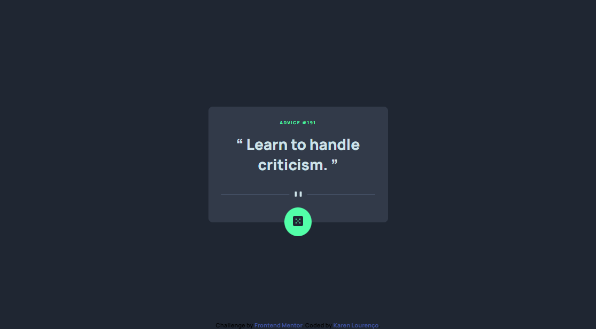
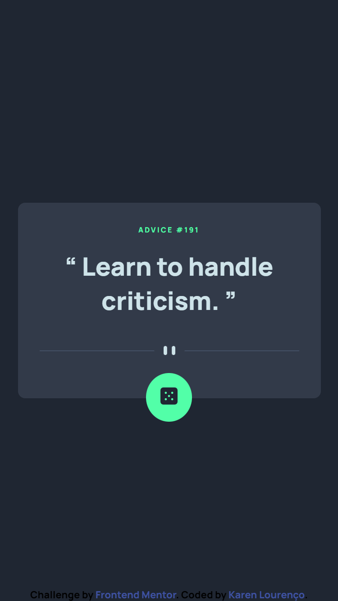

# Frontend Mentor - Advice generator app solution

This is a solution to the [Advice generator app challenge on Frontend Mentor](https://www.frontendmentor.io/challenges/advice-generator-app-QdUG-13db). Frontend Mentor challenges help you improve your coding skills by building realistic projects.

## Table of contents

  - [The challenge](#the-challenge)
  - [Screenshot](#screenshot)
  - [Links](#links)
  - [Built with](#built-with)
- [Author](#author)

### The challenge

Users should be able to:

- View the optimal layout for the app depending on their device's screen size
- See hover states for all interactive elements on the page
- Generate a new piece of advice by clicking the dice icon

### Screenshot

 

### Links

- Solution URL: [Solution URL](https://github.com/KarenMascarenhasLourenco/Frontend-Mentor/tree/main/Junior/advice-generator-app-main)
- Live Site URL: [Live Site URL](https://your-live-site-url.com)

### Built with

- Semantic HTML5 markup
- CSS custom properties
- Flexbox
- CSS Grid
- JavaScript
- 3rd-party API
- TypeScript

## Author

- Website - [Karen Lourenco](https://karenmascarenhaslourenco.github.io/)
- Frontend Mentor - [@KarenMascarenhasLourenco](https://www.frontendmentor.io/profile/KarenMascarenhasLourenco)