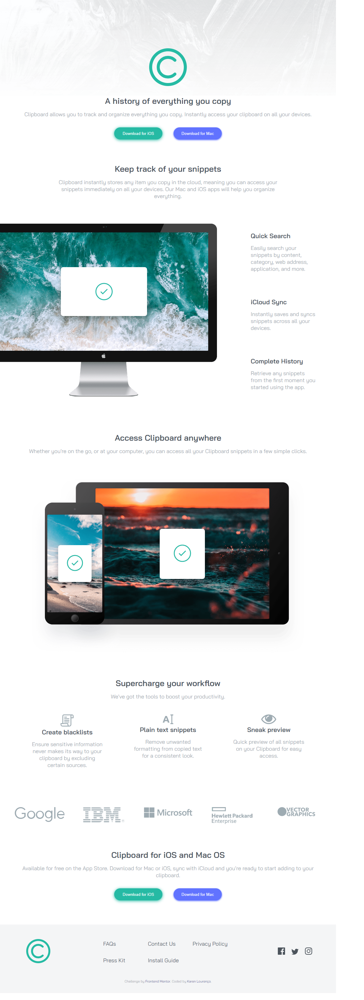

# Frontend Mentor - Clipboard landing page solution

This is a solution to the [Clipboard landing page challenge on Frontend Mentor](https://www.frontendmentor.io/challenges/clipboard-landing-page-5cc9bccd6c4c91111378ecb9). Frontend Mentor challenges help you improve your coding skills by building realistic projects. 

## Table of contents

  - [The challenge](#the-challenge)
  - [Screenshot](#screenshot)
  - [Links](#links)
  - [Built with](#built-with)
- [Author](#author)

### The challenge

Users should be able to:

- View the optimal layout for the site depending on their device's screen size
- See hover states for all interactive elements on the page

### Screenshot

### Links

- Solution URL: [Solution URL](https://github.com/KarenMascarenhasLourenco/Frontend-Mentor/tree/main/Newbie/clipboard-landing-page-master)
- Live Site URL: [Live Site](https://voluble-gelato-6c3c3e.netlify.app/)

### Built with

- Semantic HTML5 markup
- CSS custom properties
- Flexbox
- CSS Grid

## Author

- Website - [Karen Lourenço](https://karenmascarenhaslourenco.github.io/)
- Frontend Mentor - [@KarenMascarenhasLourenco](https://www.frontendmentor.io/profile/KarenMascarenhasLourenco)