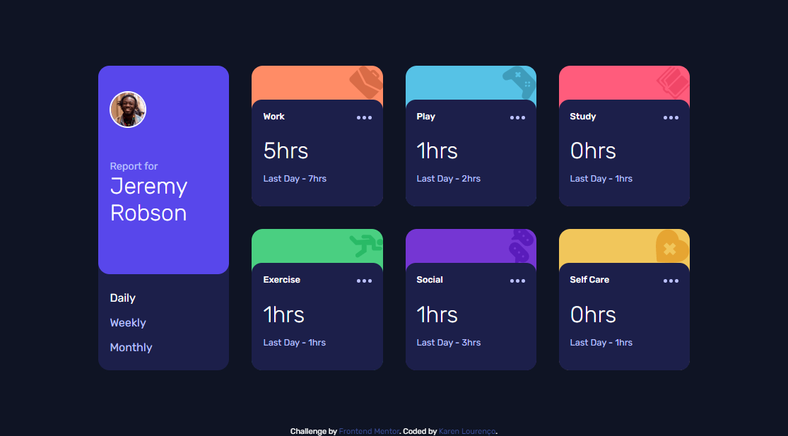

# Frontend Mentor - Time tracking dashboard solution

This is a solution to the [Time tracking dashboard challenge on Frontend Mentor](https://www.frontendmentor.io/challenges/time-tracking-dashboard-UIQ7167Jw). Frontend Mentor challenges help you improve your coding skills by building realistic projects. 

## Table of contents

  - [The challenge](#the-challenge)
  - [Screenshot](#screenshot)
  - [Links](#links)
  - [How to use](#how-to-use)
  - [Built with](#built-with)
- [Author](#author)

### The challenge

Users should be able to:

- View the optimal layout for the site depending on their device's screen size
- See hover states for all interactive elements on the page
- Switch between viewing Daily, Weekly, and Monthly stats

### Screenshot

 

### Links

- Solution URL: [URL Solution](https://github.com/KarenMascarenhasLourenco/Frontend-Mentor/tree/main/Junior/time-tracking-dashboard-main)
- Live Site URL: [Live Site](https://time-tracking-karen-lourenco.netlify.app/)

### How to use
To run the project, follow these steps:

1. Clone the repository
  git clone https://github.com/KarenMascarenhasLourenco/Frontend-Mentor.git

2. Navigate to the project directory
  cd Frontend-Mentor/Junior/time-tracking-dashboard-react

3. Install dependencies
  npm install

4. Run the development server
  npm start

5. Open the application in your web browser
  http://localhost:3000/

### Built with

- Semantic HTML5 markup
- CSS custom properties
- Flexbox
- CSS Grid
- [React](https://reactjs.org/) - JS library
- TypeScript

## Author

- Website - [Karen Lourenco](https://karenmascarenhaslourenco.github.io/)
- Frontend Mentor - [@KarenMascarenhasLourenco](https://www.frontendmentor.io/profile/KarenMascarenhasLourenco)