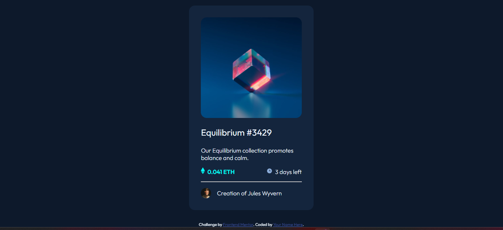

# Frontend Mentor - NFT preview card component solution

This is a solution to the [NFT preview card component challenge on Frontend Mentor](https://www.frontendmentor.io/challenges/nft-preview-card-component-SbdUL_w0U). Frontend Mentor challenges help you improve your coding skills by building realistic projects. 

## Overview

### The challenge

Users should be able to:

- View the optimal layout depending on their device's screen size
- See hover states for interactive elements

### Screenshot

### Links

- Solution URL: https://github.com/KarenMascarenhasLourenco/Frontend-Mentor/tree/main/Newbie/nft-preview-card-component-main
- Live Site URL: https://nft-preview-card-karen-lourenco.netlify.app/

### Built with

- Semantic HTML5 markup
- Flexbox

## Author

- Website - [Karen Lourenço](https://karenmascarenhaslourenco.github.io/)
- Frontend Mentor - [@KarenMascarenhasLourenco](https://www.frontendmentor.io/profile/KarenMascarenhasLourenco)

